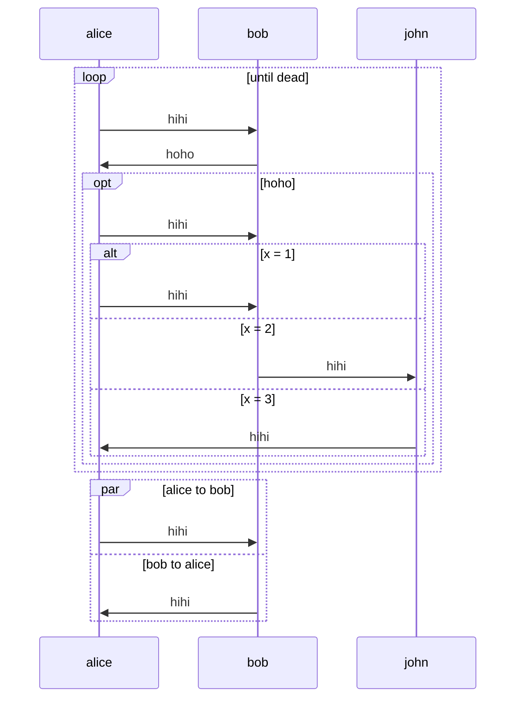

# Mermaid.kt

## Usage

As described in the tests, a possible usage would be:

```kotlin
val alice = Actor("alice")
val bob = Actor("bob")
val john = Actor("john")

val example1 = sequenceDiagram {
    loop("until dead") {
	solidArrow(alice, bob, "hihi")
	solidArrow(bob, alice, "hoho")
	optional("hoho") {
	    solidArrow(alice, bob, "hihi")
	    alternative("x = 1") {
		solidArrow(alice, bob, "hihi")
		elseClause("x = 2") {
		    solidArrow(bob, john, "hihi")
		}
		elseClause("x = 3") {
		    solidArrow(john, alice, "hihi")
		}
	    }
	}
    }
    parallel("alice to bob") {
	solidArrow(alice, bob, "hihi")
	andClause("bob to alice") {
	    solidArrow(bob, alice, "hihi")
	}
    }
}
```

The above translates to:

